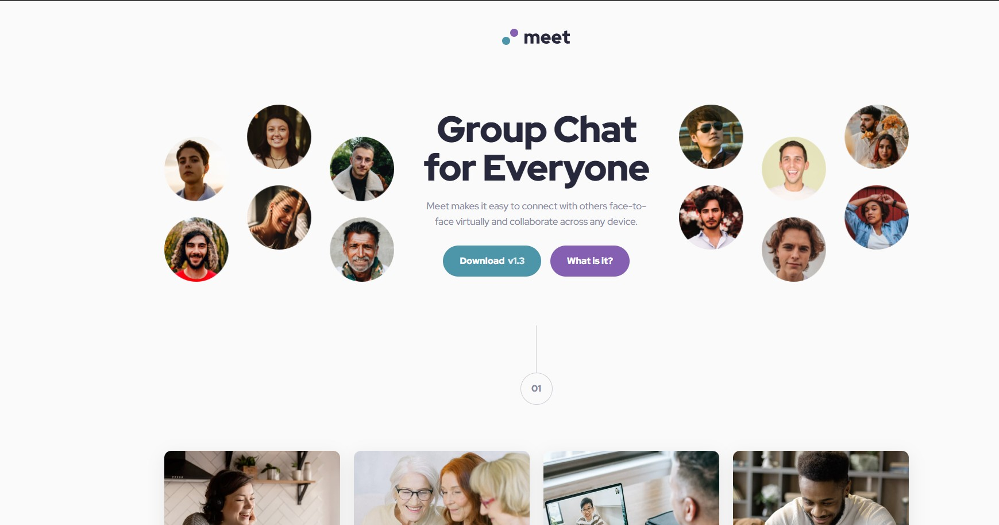
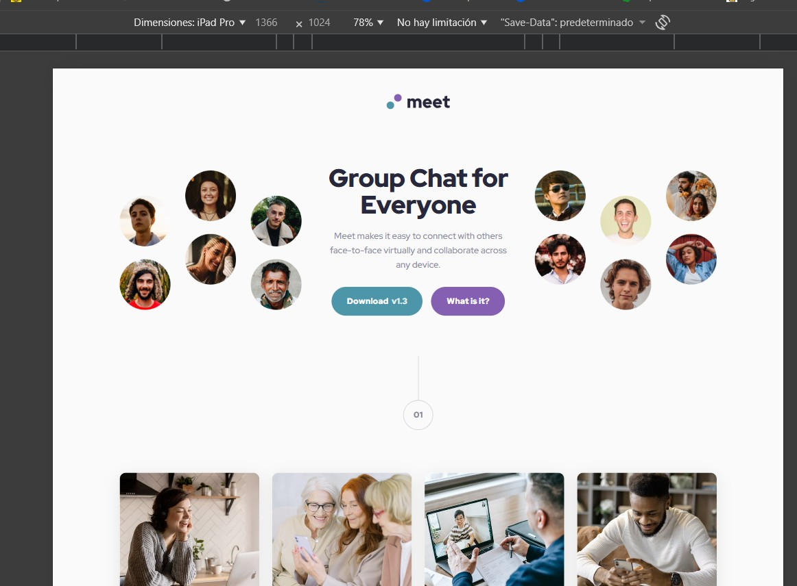
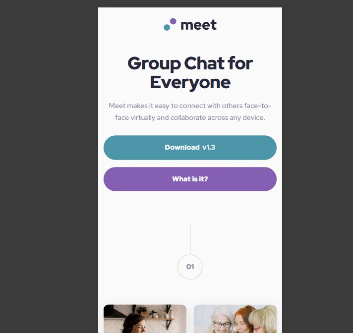

# Frontend Mentor – Meet landing page solution

This is my solution to the **Meet landing page** challenge on Frontend Mentor.  
Frontend Mentor challenges help improve front-end skills by building realistic projects using real-world layouts and design constraints.

---

## Table of contents

- [Overview](#overview)
  - [The challenge](#the-challenge)
  - [Screenshot](#screenshot)
  - [Links](#links)
- [My process](#my-process)
  - [Built with](#built-with)
  - [What I learned](#what-i-learned)
  - [Continued development](#continued-development)
  - [Useful resources](#useful-resources)
- [Author](#author)

---

## Overview

### The challenge

Users should be able to:

- View the optimal layout for the interface depending on their device’s screen size  
- See hover and focus states for all interactive elements  

---

### Screenshot

**Desktop**

**Tablet**

**Mobile**

---

### Links

- **Solution URL:**  
  https://www.frontendmentor.io/solutions/meet-landing-page-bootstrap-responsive-layout-qJaseff

- **Live Site URL:**  
  https://jaseff2805.github.io/FrontEndMentor_MeetLandingPage_Jaseff2805/

---

## My process

### Built with

- Semantic HTML5 markup  
- Bootstrap 5 (grid system and utilities)  
- CSS custom properties (variables)  
- Mobile-first workflow  
- Flexbox and CSS Grid  
- Accessibility best practices (focus states, skip link)

---

### What I learned

This project helped reinforce the importance of structuring layouts semantically while combining a CSS framework with custom styles effectively.

Key takeaways:

- How to use **Bootstrap only where it adds value**, keeping custom CSS clean and minimal  
- How **CSS variables** greatly improve maintainability and visual consistency  
- How spacing, typography scale, and subtle hover/focus states dramatically improve perceived quality  
- The importance of matching assets and breakpoints precisely to achieve a pixel-accurate responsive design  

---

### Continued development

In future projects, I want to:

- Improve performance scores by optimizing images and auditing Lighthouse metrics  
- Continue refining accessibility practices, especially keyboard navigation and ARIA usage  
- Explore CSS container queries to further enhance responsiveness  

---

### Useful resources

- [Bootstrap Documentation](https://getbootstrap.com/docs/5.3/getting-started/introduction/) – Grid system and utility classes  
- [MDN Web Docs](https://developer.mozilla.org/) – HTML, CSS, and accessibility references  
- [Frontend Mentor Community](https://www.frontendmentor.io/community) – Feedback and inspiration from other developers  

---

## Author

- **GitHub:** https://github.com/jaseff2805  
- **Frontend Mentor:** https://www.frontendmentor.io/profile/jaseff2805  
- **LinkedIn:** https://www.linkedin.com/in/omar-jaseff-bautista-baz%C3%A1n-35a6a1244/

---
